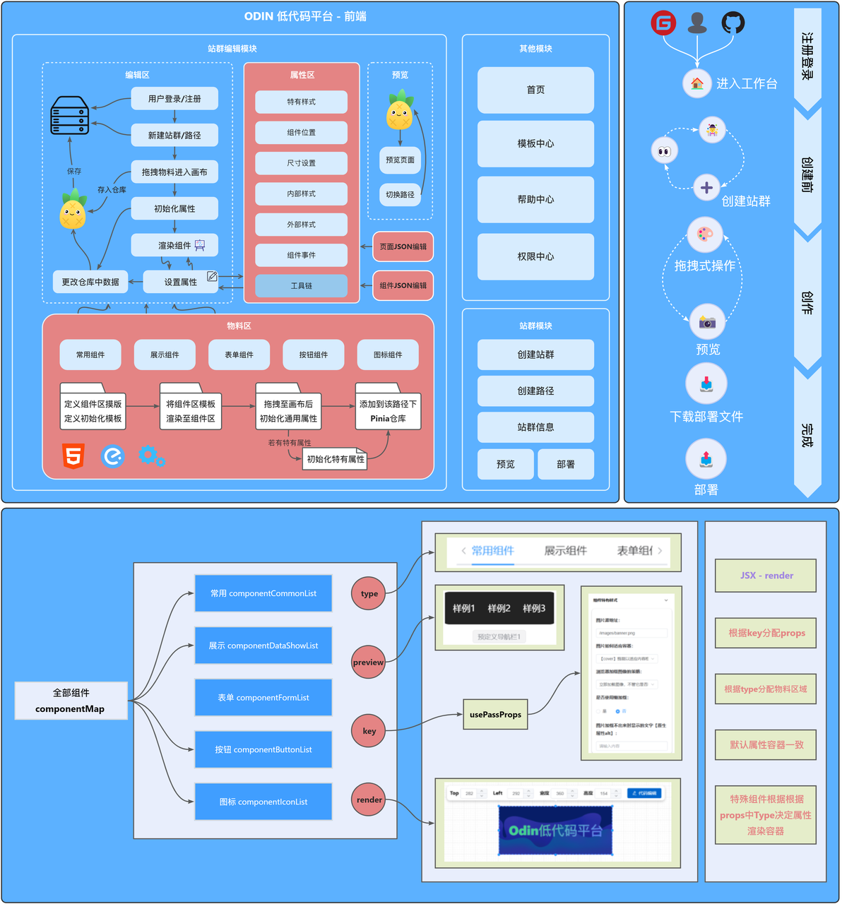

>  体验地址：http://odin.neuqer.com

# 核心编辑器构思时的难点：

> - 如何在页面上展示用户可以使用的物料？
> - 如何将物料拖拽到画布上即可渲染？
> - 画布上排版方式是哪种？
> - 如何判断当前 拖拽/删除/点击/设置 的是哪个组件？
> - 拖拽调整组件尺寸（周围八个点）如何做？
> - 如何将预览的界面撑满整个屏幕？
> - 如何根据elementPlus的属性可视化配置组件属性？
>    - 对于一些表单类或者其他有单独样式的如何配置？
> - 如何通过简单配置即可增加新的物料？
> - 如何 全选/Ctrl+点击单独选中/鼠标框选 然后进行操作？
> - 撤销/恢复/复制/剪切/粘贴 如何做？
> - JSON编辑器如何设置属性？
>
另外一些优化体验的：
> - 双击需要文字的可以变成文本框输入，如何做？
> - 自动保存
> - 上传图片
> - 添加标尺和网格
> - 双击物料自动添加，不用拖拽
> - 添加新手引导

# 逐个解决：
## 如何在页面上展示用户可以使用的物料？

通过维护一个`componentMap`，其中包括了所有的物料，每一种物料维护在一个单独的文件

该文件导出了`createEditorConfig`，在每种物料引入，调用其返回的函数，该函数需要传入一系列参数，传入之后可以通过其中的辅助函数：
```javascript
function pushList(type, component) {
	const actions = {
		common: commonComponent => componentCommonList.push(commonComponent),
		dataShow: dataShowComponent => componentDataShowList.push(dataShowComponent),
		form: formComponent => componentFormList.push(formComponent),
		button: buttonComponent => componentButtonList.push(buttonComponent),
		icons: iconsComponent => componentIconList.push(iconsComponent)
	}
	return actions[type](component)
}
```
在单独的物料中调用该返回函数，获取其中的`type`以及其他值，`type`的作用是用来区分该组件属于哪个种类，例如：
```jsx
registerConfig.register(
	{
		type: 'common',
		preview: () => <NavigationTd />,
		render: (blockStyles, block) => (
			<NavigationTd style={blockStyles.value} class="renderNavigationBase" {...block.componentProps}></NavigationTd>
		),
		key: '一级导航栏'
	},
)
```

- type：用来将传入的物料分配到对应的数组。
- preview：展示使用，调用该方法在画布左侧渲染。
- render：物料拖拽至画布上时渲染的组件，其中`class`类为对应初始样式，`style`则为通用样式，`{...block.componentProps}`为组件特有样式的属性。
- key：拖拽至画布渲染时候通过`key`来判断使用的是哪个组件。
```javascript
components.map(component => {
	pushList(component.type, component)
	componentMap[component.key] = component
})
```
`... components`包括所有的单独物料配置，通过map遍历该配置数组，调用`pushList`的方法，传入提取的`type`进行分配，然后将值直接传入至对应数组中存储，并且将所有物料传入`componentMap`中集中存储。
```jsx
// 物料区列表
// label: 导航描述 | ClassKey：物料区CSS样式关键字 | list：物料 | tag：是否展示徽章描述
const componentList = [
	{
		label: '常用组件',
		Classkey: 'common',
		list: config.componentCommonList,
		tag: true
	},
	{
		label: '展示组件',
		Classkey: 'data',
		list: config.componentDataShowList,
		tag: true
	},
	{ label: '表单组件', Classkey: 'form', list: config.componentFormList, tag: true },
	{
		label: '按钮组件',
		Classkey: 'button',
		list: config.componentButtonList,
		tag: false
	},
	{ label: '图标组件', Classkey: 'icon', list: config.componentIconList, tag: false }
]
```
```jsx
<el-tabs stretch style="margin:0 15px">
	{componentList.map(item => (
	<el-tab-pane label={item.label} lazy className={`editor-component-${item.Classkey}`}>
		{item.list.map(component => (
		<div>
			<div
				className={`editor-component-${item.Classkey}-item component`}
				draggable
				onDragstart={e => dragstart(e, component)}
				onDragover={dragover}
				onDragend={dragend}
				onDblclick={() => dblClick(component)}
				>
				{component.preview()}
			</div>
			{item.tag ? (
			<el-tag type="info" style="margin-bottom: 35px;">
				{component.key}
			</el-tag>
		) : null}
		</div>
	))}
	</el-tab-pane>
))}
</el-tabs>
```
这样物料展示区就能成功渲染在左侧了

---

## 如何将物料拖拽到画布上即可渲染？
在上一部分最后一个代码中，渲染物料展示时，循环渲染出的组件绑定了拖拽事件
在`useMenuDragger.js`中导出了多个方法：
```jsx
// 物料区拖拽
const containerRef = ref(null)
const canvasRef = ref(null)
const { dragstart, dragend, dblClick, imageDrop, dragover } = useMenuDragger(containerRef, canvasRef)
```
两个`ref`分别对应内容区和画布区，内容区用来产生滚动条。
在这里我们只探讨`dragstart` `dragend` `dragover`三个方法
```javascript
// dragenter 进入元素中
const dragenter = e => {
    e.dataTransfer.dropEffect = 'move'
}
// dragover 在目标元素经过 必须要阻止默认行为 否则不能触发drop
const dragover = e => {
    e.preventDefault()
}
// dragleave 离开元素的时候 需要增加一个禁用标识
const dragleave = e => {
    e.dataTransfer.dropEffect = 'none'
}

const dragstart = (e, component) => {
    containerRef.value.addEventListener('dragenter', dragenter)
    containerRef.value.addEventListener('dragover', dragover)
    containerRef.value.addEventListener('dragleave', dragleave)
    containerRef.value.addEventListener('drop', drop)
    currentComponent = component
}

const dragend = e => {
    e.preventDefault()
    containerRef.value.removeEventListener('dragenter', dragenter)
    containerRef.value.removeEventListener('dragover', dragover)
    containerRef.value.removeEventListener('dragleave', dragleave)
    containerRef.value.removeEventListener('drop', drop)
}
```
在调用`dragstart`时候，我们传入了当前的组件实例，并赋值给`currentComponent`，这里的`currentComponent`就是：
```jsx
{
	type: 'common',
		preview: () => <NavigationTd />,
		render: (blockStyles, block) => (
		<NavigationTd style={blockStyles.value} class="renderNavigationBase" {...block.componentProps}></NavigationTd>
	),
		key: '一级导航栏'
},
```
给`containerRef`添加drag事件，当拖拽至画布时候松手即可渲染，然后进行一系列的操作，如下：
```javascript
const drop = e => {
	let marginLeft = Number((getComputedStyle(containerRef.value, null).marginLeft).split('px')[0]).toFixed(0)
	e.preventDefault()
	// 隐藏属性/zoom设置
	data.isEditText = false
	data.popoverShow = false
	data.zoomShow = false
	// 清空所有焦点元素
	for (let index = 0; index < data.canvas.blocks.length; index++) {
		data.canvas.blocks[index].focus = false
	}
	// 是否展示内部样式关于文本属性设置
	let isShowText = true
	if (disabledKey.includes(currentComponent.key)) {
		isShowText = false
	}
	data.canvas.blocks.push({
		id: nanoid(), // 通过utils生成画布上每个组件的唯一id
		key: currentComponent.key, // 组件标识
		// 组件位置
		top: (e.pageY - 42 + Number(canvasRef.value.scrollTop) - 15) / data.canvas.zoom, // 顶部距离
		left: (e.pageX - 15 - 308 - Number(marginLeft)) / data.canvas.zoom, // 左侧距离
		zIndex: 3, // 层级
		// 组件整体尺寸
		width: null, // 宽度
		height: null, // 高度
		// 组件内部样式
		isShowText: isShowText, // 是否展示内部样式关于文本属性设置
		text: '请输入文本内容', // 组件内文本
		bgcColor: null, // 背景颜色
		bgcImage: null, // 背景图
		bgcSize: 'cover', // 背景图大小
		fontColor: null, // 字体颜色
		size: 16, // 字体大小
		fontWeight: 'normal', // 字体粗细
		// 组件外部样式
		rotate: 0, // 旋转角度
		zoom: 1, // 缩放比例
		opacity: 1, // 透明度
		borderRadius: 0, // 圆角
		// 阴影
		boxShadow: {
			x: 0,
			y: 0,
			blurRadius: 0,
			SpreadRadius: 0,
			color: '#000'
		},
		// 组件特有样式
		componentProps: {},
		alignCenter: true, // 鼠标松开居中
		focus: false // 组件拖入不自动选中
	})
	currentComponent = null
}
```

- 拖拽放下之后，因为画布可能会缩放，所以获取计算后的值
- data 是 pinia 中的数据
- 然后将一些属性初始化
- 清空当前已经选中的组件
- 向画布数据`data.canvas.blocks`中加入新的组件
- 新组件的 id 值是区分画布中组件的唯一值，其他则是一些属性
```jsx
<div id="box">
    {data.canvas.blocks.map((block, index) => (
    <EditorBlock
        class={block.focus ? 'editor-block-focus' : ''}
        block={block}
        index={index}
        onMousedown={e => {
            blockMousedown(e, block)
            popoverPosition.value = e
        }}
        ></EditorBlock>
))}
</div>
```
`data.canvas.blocks`添加新组件之后，就会遍历渲染（但是每次数据变化都会重新执行遍历然后渲染，因此会有很大的性能损耗，有待优化），这样在画布上就会通过`<EditorBlock>....</EditorBlock>`渲染新的数据。
`<EditorBlock>....</EditorBlock>`组件会返回`component`中的`render`并加一层外壳，以实现一些特殊的样式，一些样式的设置，事件的执行，是否双击编辑文本会单独的封装在该组件中，这样每个组件相互独立，方便后续的维护。
> 以上就是对于拖拽之后如何渲染的流程解释


---

## 画布上排版方式是哪种？

- 采用画布`position: relative`，内部每个组件`position: absolute`进行定位
- 拖拽时候改变`left` `top`值
   - 组件无法超出画布区域，通过边缘拖拽也无法超出边缘

---

## 如何判断当前 拖拽/删除/点击/设置 的是哪个组件？
我们来看看拖拽之后的操作，这里会向`data.canvas.blocks`中存入数据，在结构中会调用`nanoid()`第三方库加入随机唯一`key`，在以后的操作中可以通过匹配`key`来进行相关操作
```javascript
data.canvas.blocks.push({
	id: nanoid(), // 通过utils生成画布上每个组件的唯一id
	// .......
})
```

---

## 拖拽调整组件尺寸（周围八个点）如何做？
组件边缘的点位为一个单独的组件，通过获取当前点击元素的DOM，然后将其定位到周围。为每个点位添加事件，在拖动时候改变当前组件的宽高。这里以左侧点位为例子：
```javascript
{
// ...
lStartX: null,
lMain(e) {
	e.stopPropagation()
	e.preventDefault()
	data.canvas.focusData.width += resizeMain.lStartX - e.clientX
	data.canvas.focusData.left += e.clientX - resizeMain.lStartX
	resizeMain.lStartX = e.clientX
	if (data.canvas.focusData.width <= 18) {
		data.canvas.focusData.width = 20
		document.removeEventListener('mousemove', resizeMain.lMain)
	}
}
// ...
}
```

---

## 如何将预览的界面撑满整个屏幕？
使用 `zoom`属性整体按比例缩放即可

---

## 如何根据elementPlus的属性可视化配置组件属性？
进行到这里，存入`Pinia`中每个组件中的`key`是标识组件的唯一性，每种组件的`key`是唯一的，因此通过`key`来进行属性传入即可实现独特的属性配置。
```javascript
export function passProps(block) {
	switch (block.key) {
		case '多选框':
			block.componentProps = deepcopy(checkboxProps)
			break

		case '单选框':
			block.componentProps = deepcopy(radioProps)
			break

		case '开关切换':
			block.componentProps = deepcopy(switchProps)
			break

		case '颜色选择器':
			block.componentProps = deepcopy(colorPickerProps)
			break

		case '日期选择器':
			block.componentProps = deepcopy(datePickerProps)
			break

		case '综合输入框':
			block.componentProps = deepcopy(inputProps)
			break

		case '数字输入框':
			block.componentProps = deepcopy(inputNumberProps)
			break

		case '评分器':
			block.componentProps = deepcopy(rateProps)
			break

		case '滑块':
			block.componentProps = deepcopy(sliderProps)
			break

		case '头像':
			block.componentProps = deepcopy(avatarProps)
			break

		case '徽章':
			block.componentProps = deepcopy(badgeProps)
			break

		case '轮播图':
			block.componentProps = deepcopy(bannerProps)
			break

		case '图片':
			block.componentProps = deepcopy(imgProps)
			break

		case '分页器':
			block.componentProps = deepcopy(paginationProps)
			break

		case '进度条':
			block.componentProps = deepcopy(progressProps)
			break

		case '结果':
			block.componentProps = deepcopy(resultProps)
			break

		case '标签':
			block.componentProps = deepcopy(tagProps)
			break

		case '卡片':
			block.componentProps = deepcopy(cardProps)
			break

		case '时间线':
			block.componentProps = deepcopy(timelineProps)
			break

		case '自动生成式导航栏':
			block.componentProps = deepcopy(navigationBase)
			break

		case '自定义导航栏':
			block.componentProps = deepcopy(navigationCustom)
			break

		case '二级导航栏':
			block.componentProps = deepcopy(navigationCustom)
			break

		case '一级导航栏':
			block.componentProps = deepcopy(navigationTd)
			break

		case '分隔线':
			block.componentProps = deepcopy(dividerProps)
			break

		default:
			break
	}
}
```
通过该函数，只要传入某个组件，通过判断`key`即可在其内部添加上对应的属性。
这里以徽章的`Props`为例：（通过对象传入统一的值尝试过，但是获取深层次值之后一直是undefined）
```javascript
export const badgeProps = {
	type: 'danger',
	typeLabel: '样式类型',
	typeType: 'select',
	typeOption: [
		{ value: 'primary', label: '主要' },
		{ value: 'success', label: '成功' },
		{ value: 'warning', label: '警告' },
		{ value: 'danger', label: '危险' },
		{ value: 'info', label: '信息' },
	],

	value: '请输入文本内容',
	valueLabel: '文本内容',
	valueType: 'input',

	isDot: false,
	isDotLabel: '是否为圆点',
	isDotType: 'radio',
}

```
这样之后每个组件的`componentProps`属性就已经设置完成。但是我们要注意，每个`props`的设置方式是统一的吗？他们应该会有输入框，数字输入框，单选框，颜色选择器等，因此我们在传入`componentProps`的时候也必须把`props`对应的类型传入。对于一些特殊的可视化方式，也可以在该文件通过`${key}Type`进行个性化配置。
```jsx
import { defineComponent , ref, watch} from 'vue'
import { useData } from '../../../../stores/data'
import message from '../../../../utils/message'
import PathInput from '../../../packages/Navigation/helpers/PathInput.vue'
import ImageUrlInputVue from './ImageUrlInput.vue'

export default defineComponent({
	setup() {
		const data = useData()
		return () => {
			return Object.keys(data.canvas.focusData.componentProps).map(key => {
				if (data.canvas.focusData.componentProps[`${key}Type`] === 'radio') {
					return (
						<div>
							<h3>{data.canvas.focusData.componentProps[`${key}Label`]}：</h3>
							<el-radio-group v-model={data.canvas.focusData.componentProps[key]}>
								<el-radio label={true} size="large">
									是
								</el-radio>
								<el-radio label={false} size="large">
									否
								</el-radio>
							</el-radio-group>
						</div>
					)
				} else if (data.canvas.focusData.componentProps[`${key}Type`] === 'input-number') {
					return (
						<div>
							<h3>{data.canvas.focusData.componentProps[`${key}Label`]}：</h3>
							<el-input v-model_number={data.canvas.focusData.componentProps[key]} />
						</div>
					)
				}
				else if (data.canvas.focusData.componentProps[`${key}Type`] === 'input-number2') {
					return (
						<div>
							<h3>{data.canvas.focusData.componentProps[`${key}Label`]}：</h3>
							<el-input-number v-model_number={data.canvas.focusData.componentProps[key]} />
						</div>
					)
				} else if (data.canvas.focusData.componentProps[`${key}Type`] === 'input') {
					return (
						<div>
							<h3>{data.canvas.focusData.componentProps[`${key}Label`]}：</h3>
							<el-input v-model={data.canvas.focusData.componentProps[key]} placeholder="请输入内容" clearable />
						</div>
					)
				}
				else if (data.canvas.focusData.componentProps[`${key}Type`] === 'imageUrlInput') {
					return (
						<div>
							<h3>{data.canvas.focusData.componentProps[`${key}Label`]}：</h3>
							<ImageUrlInputVue v-model={data.canvas.focusData.componentProps[key]} />
						</div>
					)
				}
				else if (data.canvas.focusData.componentProps[`${key}Type`] === 'date') {
					return (
						<div>
							<h3>{data.canvas.focusData.componentProps[`${key}Label`]}：</h3>
							<el-input v-model={data.canvas.focusData.componentProps[key]} type="date" clearable />
						</div>
					)
				} else if (data.canvas.focusData.componentProps[`${key}Type`] === 'select') {
					return (
						<div>
							<h3>{data.canvas.focusData.componentProps[`${key}Label`]}：</h3>
							<el-select v-model={data.canvas.focusData.componentProps[key]} placeholder="下拉选中">
								{data.canvas.focusData.componentProps[`${key}Option`].map(item => {
							return <el-option key={item.value} label={item.label} value={item.value} />
						})}
							</el-select>
						</div>
					)
				} else if (data.canvas.focusData.componentProps[`${key}Type`] === 'colorPicker') {
					return (
						<div>
							<h3> {data.canvas.focusData.componentProps[`${key}Label`]} : </h3>
							<el-color-picker v-model={data.canvas.focusData.componentProps[`${key}`]} />
						</div>
					)
				} else if (data.canvas.focusData.componentProps[`${key}Type`] === 'PathInput') {
					return (
						<div>
							<h3> {data.canvas.focusData.componentProps[`${key}Label`]} : </h3>
							<PathInput v-model:path={data.canvas.focusData.componentProps[`${key}`]} />
						</div>
					)
				} else if (data.canvas.focusData.componentProps[`${key}Type`] === 'banner') {
					return (
						<div>
							<h3>{data.canvas.focusData.componentProps[`${key}Label`]}：</h3>
							{data.canvas.focusData.componentProps.bannerGroup.map((src, index) => {
							return (
								<el-input
									v-model={data.canvas.focusData.componentProps.bannerGroup[index]}
									placeholder="请输入图片地址"
									clearable
									style="margin-bottom:5px;"
									>
									{{
										prepend: () => (
											<el-button
												icon={'DeleteFilled'}
												onClick={() => {
													if (data.canvas.focusData.componentProps.bannerGroup.length > 1) {
														data.canvas.focusData.componentProps.bannerGroup.splice(index, 1)
													} else {
														message.warning('提示：最少应有一个图片',)
													}
												}}
												/>
										),
										append: () => (
											<el-button
												icon={'CirclePlusFilled'}
												onClick={() => {
													data.canvas.focusData.componentProps.bannerGroup.splice(index + 1, 0, '/banner.png')
												}}
												/>
										)
									}}
								</el-input>
							)
						})}
						</div>
					)
				}
			})
		}
	}
})

```
这样之后就可以成功渲染出来：


---

## 如何通过简单配置即可增加新的物料？
经过以上分析，只要在每个种类文件中新增类似于：
```javascript
{
		type: '种类',
		preview: () => <xxx />,
		render: (blockStyles, block) => (
			<xxx style={blockStyles.value} class="renderXxx" {...block.componentProps}></xxx>
		),
		key: 'key'
	}
```
这样之后就可以成功渲染至物料区，如何该组件需要特有的属性设置，创建对应的props结构设置即可。

---

## 如何 全选/Ctrl+点击单独选中/鼠标框选 然后进行操作？
每个组件内部都有一个`focus`属性，当该属性为true时候就会将其选中。
但是选中多个组件时候，如果只是单纯的将选中的组件属性设置为focus就会显得有些吃力。因此在多个组件被选中时候就会被添加至`focusMoreList`中，因为每个组件被渲染至画布上都会有各自的拖动方法，通过鼠标变化的值在自身原本进行增减，这样就可以批量操作多个组件进行移动；此时我们已经获取到想要操作的组件，且pinia的数据是响应式的，也就是拷贝之后对`focusMoreList`的操作也会同步影响`data.canvas.block`的，然后删除的话可以直接通过ID查询对应的直接通过`splice`方法移出即可。

- 通过以上原理，剩下的无非就是判断是不是按下了 Ctrl 键/Ctrl + A/鼠标框选，让其自己判断是否是目标组件，添加到`focusMoreList`即可。
- 至于鼠标框选：
> 选矩形是否与 checkbox 矩形 相交或者包含在内,即两矩形是否相交或者存在包含关系
> 假定矩形 A1 左上角坐标为 (x1,y1);矩形宽度为 width1,高度为 height1;
> 假定矩形 A2 左上角坐标为 (x2,y2);矩形宽度为 width2,高度为 height2;

```javascript
maxX = Math.max(x1 + width1, x2 + width2)
minX = Math.max(x1, x2)
maxY = Math.max(y1 + height1, y2 + height2)
minY = Math.max(y1, y2)
```
> 只要满足
> `**maxX - minX <= width1 + width2**`
> `**maxX - minX <= width1 + width2**`
> 就说明鼠标已经将该 DOM 框选
> 


---

## 撤销/恢复/复制/剪切/粘贴 如何做？
因为每次执行操作，Pinia仓库总会变化，因此只要通过`watch`监听即可。
这里有一个`isAddNewData`变量，对于一些会改变 Pinia 数据的，但是不想添加快照，将其设置为`false`，执行完毕之后变为`true`即可。`limitNum`则是最大快照数量。
```javascript
import { defineStore } from 'pinia'
import { ref, watch } from 'vue'
import { useData } from './data.js'
import deepcopy from 'deepcopy'
const data = useData()

export const useSnapshot = defineStore('snapshot', () => {
	let snapshotData = ref([])
	let snapshotIndex = ref(0)
	let timer = null
	let isAddNewData = ref(true)
	const limitNum = 11 // 保存数据量的最大数（11 - 1 = 10）

	watch(() => data.canvas.blocks, (newVal) => {
		if (isAddNewData.value) {
			clearTimeout(timer)
			timer = setTimeout(() => {
				snapshotData.value.push(deepcopy(newVal))
				if (snapshotData.value.length === limitNum) snapshotData.value.shift()
				snapshotIndex.value = snapshotData.value.length - 1
				timer = null
			}, 200);
		}
		isAddNewData.value = true
	}, { deep: true })

	// 撤销
	const undo = () => {
		isAddNewData.value = false
		if (snapshotIndex.value === 0) return false
		snapshotIndex.value--
		data.canvas.blocks = deepcopy(snapshotData.value[snapshotIndex.value])
	}

	// 恢复
	const redo = () => {
		isAddNewData.value = false
		if (snapshotIndex.value === snapshotData.value.length - 1) return false
		snapshotIndex.value++
		data.canvas.blocks = deepcopy(snapshotData.value[snapshotIndex.value])
	}

	return {
		snapshotData,
		snapshotIndex,
		isAddNewData,
		undo,
		redo
	}
})

```
对于**复制/剪切**来说，通过右键菜单触发事件或者通过快捷键，这里声明变量`ProgData`，复制或者剪切之后直接将完整的 block 深拷贝进去。
然后进行**粘贴**（id是唯一标识，因此需要重新赋值，并将粘贴后的组件位置设置到鼠标右击位置/鼠标悬浮位置的右下方）：
```javascript
function pasteElement() {
    if (ProgData === null) return false
    ProgData.id = nanoid()
    ProgData.focus = false
    ProgData.top = position.y + 15
    ProgData.left = position.x + 15
    data.canvas.blocks.push(deepcopy(ProgData))
}
```
如果此时选中了多个组件，只需要将维护的`focusMoreList`拷贝至`ProgData`中，并遍历改变`id`进行粘贴即可。

---

## JSON编辑器如何设置属性？
JSON编辑器分为组件特有的以及全局的，因此需要封装两个不同的组件。
### 组件JSON编辑器
我们首先来看组件的JSON编辑器组件
```html
<template>
    <el-drawer v-model="data.jsonEditorShow" direction="ltr">
        <json-editor-vue class="jsonEditor" v-model="newData" language="zh-CN" />
    </el-drawer>
    <Teleport to="body">
        <el-button style="position: absolute; z-index: 9999;top: 3px;left: calc(30% - 70px);height: 30px;width: 60px;"
            type="danger" plain v-if="isSave" class="animate__animated animate__tada" @click="save">保存</el-button>
    </Teleport>
</template>

<script setup>
import { useData } from '../../../../stores/data.js'
import JsonEditorVue from 'json-editor-vue3'
import deepcopy from 'deepcopy'
import { ref, watch } from 'vue'
import message from '../../../../utils/message'
const data = useData()

// 1. 提取值
let indexNow = null
for (let index = 0; index < data.canvas.blocks.length; index++) {
    if (data.canvas.blocks[index].focus === true) {
        indexNow = index
        break
    }
}

// 2. 属性过滤
const isSave = ref(false)
let newData = ref({})
let ForbiddenKeys = ['id', 'key', 'alignCenter', 'focus', 'isShowText',]
for (let blockKey in data.canvas.blocks[indexNow]) {
    if (ForbiddenKeys.indexOf(blockKey) === -1) newData.value[blockKey] = deepcopy(data.canvas.blocks[indexNow][blockKey])
    if (blockKey === 'componentProps') {
        if (Object.keys(data.canvas.blocks[indexNow][blockKey]).length === 0) {
            delete newData.value[blockKey]
        } else {
            for (let blockElementKey in data.canvas.blocks[indexNow][blockKey]) {
                if (blockElementKey.includes('Label') || blockElementKey.includes('Type') || blockElementKey.includes('Option')) {
                    delete newData.value[blockKey][blockElementKey]
                }
            }
        }
    }
}

// 3. 修改之后提示保存
watch(newData, () => {
    isSave.value = true
})

// 4. 保存
const save = () => {
    isSave.value = false
    for (let blockKey in newData.value) {
        if (blockKey === 'componentProps') {
            for (let newDataComponentPropsKey in newData.value[blockKey]) {
                if (data.canvas.blocks[indexNow][blockKey].hasOwnProperty(newDataComponentPropsKey)) {
                    data.canvas.blocks[indexNow][blockKey][newDataComponentPropsKey] = newData.value[blockKey][newDataComponentPropsKey]
                } else message.error(`componentProps 中 ${newDataComponentPropsKey} 属性不支持设置`)
            }
        } else {
            if (data.canvas.blocks[indexNow].hasOwnProperty(blockKey)) {
                data.canvas.blocks[indexNow][blockKey] = newData.value[blockKey]
            } else message.error(`${blockKey} 属性不支持设置`)
        }
    }
}
</script>

<style lang="scss" scoped>
.jsonEditor {
    position: absolute;
    top: 0;
    bottom: 0;
    left: 0;
    right: 0;
}
</style>
```
按点分析：

1. 首先获取当前编辑的组件的索引号，以便进行使用
2. 创建了一个新的响应式数据`newData`，因为在组件的配置中，存在不允许用户设置的属性，在这里直接遍历过滤即可。这样获取到的`newData`就是可以让用户修改的数据了。
3. 如果在这里直接将`newData`拷贝给`block`的话，会有很多问题出现，因此在改变之后提示用户保存即可。
4. 用户此时点击保存，此时遍历`newData`，并将每个值赋值给对应的`block`中，如果`newData`中存在`block`没有的属性，就会进行提示不支持设置，并忽略该属性。

这样流程结束之后，pinia中对应的组件数据就会改变。
### 页面JSON编辑器
然后就是全局/页面的JSON编辑器。
我们直接上代码：
```html
<template>
  <el-drawer v-model="data.pageJsonEditorShow" direction="ltr">
    <json-editor-vue class="jsonEditor" v-model="newData" language="zh-CN" />
  </el-drawer>
  <Teleport to="body">
    <el-button style="position: absolute; z-index: 9999;top: 3px;left: calc(30% - 70px);height: 30px;width: 60px;"
      type="danger" plain v-if="isSave" class="animate__animated animate__tada" @click="save">保存</el-button>
  </Teleport>
</template>

<script setup>
  import { useData } from '../../../../stores/data.js'
  import { nanoid } from 'nanoid'
  import { jsonPassProps } from '../../hook/useJsonPassProps'
  import { ref, watch } from 'vue'
  import JsonEditorVue from 'json-editor-vue3'
  import deepcopy from 'deepcopy'
  import message from '../../../../utils/message'

  const data = useData()

  let newData = ref(deepcopy(data.canvas))

  let ForbiddenKeys = ['id', 'alignCenter', 'focus', "isShowText"]
  let keyList = ['top', 'left', 'zIndex', 'width', 'height', 'text', 'bgcColor', 'bgcImage', 'bgcSize', 'fontColor', 'size', 'fontWeight', 'rotate', 'zoom', 'opacity', 'borderRadius', 'boxShadow', 'textAlign']

  const isSave = ref(false)
  watch(newData, () => {
    isSave.value = true
  })

  // 过滤限制规则
  for (let blockKey in data.canvas) {
    if (blockKey === 'container') {
      for (let containerKey in data.canvas[blockKey]) {
        if (containerKey === 'width') delete newData.value[blockKey][containerKey]
      }
    }
    if (blockKey === 'focusData') {
      delete newData.value[blockKey]
    }
    if (blockKey === 'blocks') {
      if (data.canvas[blockKey].length !== 0) {
        for (let i = 0; i < data.canvas[blockKey].length; i++) {
          for (let blocksKey in data.canvas[blockKey][i]) {
            if (ForbiddenKeys.indexOf(blocksKey) !== -1) delete newData.value[blockKey][i][blocksKey]
            if (blocksKey === 'componentProps') {
              if (Object.keys(data.canvas[blockKey][i][blocksKey]).length === 0) {
                delete newData.value[blockKey][i][blocksKey]
              } else {
                for (let blockElementKey in data.canvas[blockKey][i][blocksKey]) {
                  if (
                    blockElementKey.includes('Label') ||
                    blockElementKey.includes('Type') ||
                    blockElementKey.includes('Option')
                  ) {
                    delete newData.value[blockKey][i][blocksKey][blockElementKey]
                  }
                }
              }
            }
          }
        }
      }
    }
  }

  // 保存
  const save = () => {
    isSave.value = false
    let length = newData.value['blocks'].length
    for (let blockKey in newData.value) {
      // 判断画布属性
      if (blockKey === 'container') {
        for (let containerKey in newData.value[blockKey]) {
          if (containerKey === 'width') {
            data.canvas[blockKey][containerKey] = 1500
          } else if (containerKey === 'height') {
            data.canvas[blockKey][containerKey] = newData.value[blockKey][containerKey]
          } else if (containerKey === 'bgcColor') {
            data.canvas[blockKey][containerKey] = newData.value[blockKey][containerKey]
          } else message.error(`container - ${containerKey} 属性不支持设置`)
        }
      }
      // 元素列表
      if (blockKey === 'blocks') {
        for (let i = 0; i < length; i++) {
          // 超出即为新加元素（有且必须要有一个key）
          if (i >= data.canvas[blockKey].length) {
            // 新的默认组件
            let newEle = {
              id: nanoid(), // 通过utils生成画布上每个组件的唯一id
              key: null, // 组件标识
              top: 0, // 顶部距离
              left: 0, // 左侧距离
              zIndex: 1, // 层级
              width: 50, // 宽度
              height: 50, // 高度
              isShowText: true,
              text: '请输入文本内容', // 组件内文本
              bgcColor: null, // 背景颜色
              bgcImage: null, // 背景图
              bgcSize: 'cover', // 背景图大小
              fontColor: null, // 字体颜色
              size: 16, // 字体大小
              fontWeight: 'normal', // 字体粗细
              rotate: 0, // 旋转角度
              zoom: 1, // 缩放比例
              opacity: 1, // 透明度
              borderRadius: 0, // 圆角
              boxShadow: {
                x: 0,
                y: 0,
                blurRadius: 0,
                SpreadRadius: 0,
                color: '#000'
              },
              componentProps: {},
              alignCenter: false,
              focus: false
            }
            // 循环判断属性
            for (const entitykey in newData.value[blockKey][i]) {
              if (entitykey === 'key') {
                newEle.key = newData.value[blockKey][i][entitykey]
                newEle['componentProps'] = jsonPassProps(newEle.key)
              } else if (entitykey === 'componentProps') {
                if (Object.keys(newData.value[blockKey][i][entitykey]).length) {
                  for (let newDataComponentPropsKey in newData.value[blockKey][i][entitykey]) {
                    newEle[entitykey][newDataComponentPropsKey] =
                      newData.value[blockKey][i][entitykey][newDataComponentPropsKey]
                  }
                }
              } else if (keyList.includes(entitykey)) {
                newEle[entitykey] = newData.value[blockKey][i][entitykey]
              } else {
                message.error(`${entitykey} 属性不存在`)
              }
            }
            data.canvas.blocks.push(newEle)
          } else {
            for (let newDataElementKey in newData.value[blockKey][i]) {
              if (newDataElementKey === 'componentProps') {
                for (let newDataComponentPropsKey in newData.value[blockKey][i][newDataElementKey]) {
                  if (data.canvas[blockKey][i][newDataElementKey].hasOwnProperty(newDataComponentPropsKey)) {
                    data.canvas[blockKey][i][newDataElementKey][newDataComponentPropsKey] =
                      newData.value[blockKey][i][newDataElementKey][newDataComponentPropsKey]
                  } else {
                    message.error(`blocks - Num${i + 1} - componentProps -  ${newDataComponentPropsKey} 属性不支持设置`)
                  }

                }
              } else {
                if (data.canvas[blockKey][i].hasOwnProperty(newDataElementKey)) {
                  data.canvas[blockKey][i][newDataElementKey] = newData.value[blockKey][i][newDataElementKey]
                } else {
                  message.error(`blocks - Num${i + 1} - ${newDataElementKey} 属性不支持设置`)
                }
              }
            }
          }
        }
      }
    }
  }
</script>

<style lang="scss" scoped>
  .jsonEditor {
    position: absolute;
    top: 0;
    bottom: 0;
    left: 0;
    right: 0;
  }
</style>
```
这里也同样声明一个新的变量`newData`，和组件特有的编辑器一样，会首先将一些不允许用户设置的属性进行过滤。
再点击保存之后，会首先对全局属性进行赋值，比如高度，背景颜色等。
然后在原有属性长度内进行遍历，如果超出之后就说明新增了组件，其余在范围内就和组件特有编辑器内合并数据一致。
那我们来看看对于新设置的组件如何处理的，传入一个新组件的硬性要求是**必须要有一个**`**key**`，因为`key`是用来标识组件的，只要声明了`key`，该组件就会被添加，其他属性都会被设置为默认值；如果还传入了其他的值，则会覆盖默认值；如果传入了不允许的值，则会报错并忽略该值。
