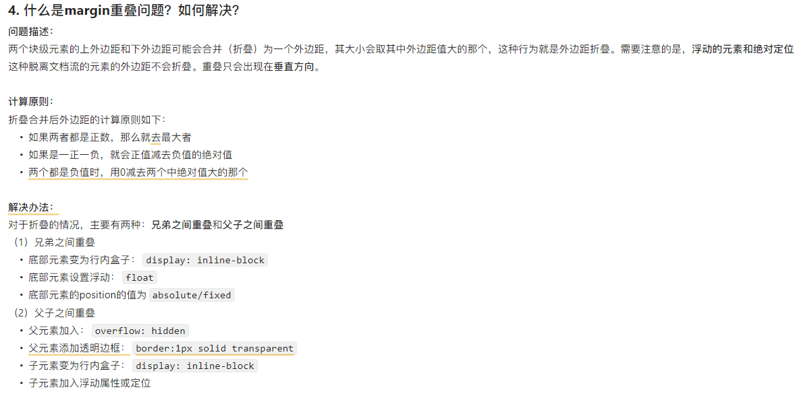

## 网上文章截图

## 总结
  - 在浏览器渲染BFC的时候，就会出现margin折叠问题。
    - 对于父子折叠，因为此时父div并没有形成BFC，只是简单的结构上包括了子div，因此将父div变成BFC即可避免内部的div影响到了外部。
    - 对于兄弟之间，就不能简单的设定连个都是BFC了，要利用BFC和浮动元素不会发生折叠去解决，或者绝对定位和固定定位，因为这就使得下面那个脱离了文档流，从而解决了margin折叠，至于inline-block，BFC和IFC并不会产生margin折叠，因为IFC不能设定上下的margin。
