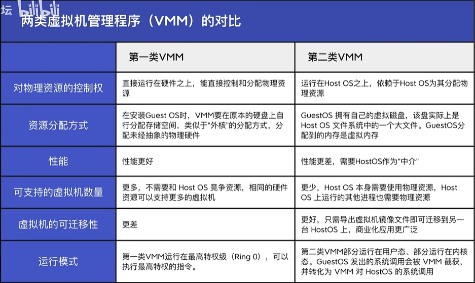
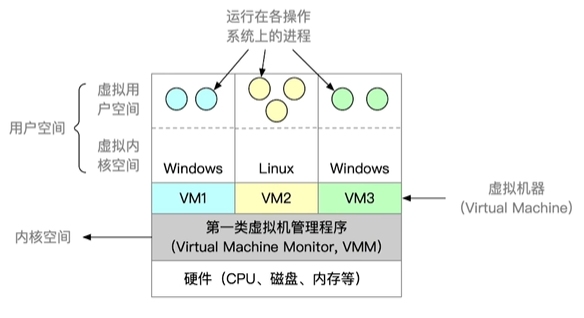
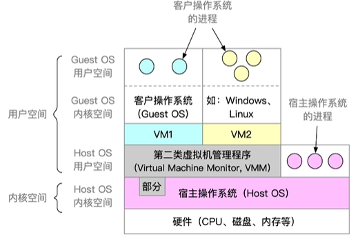

# 1. 操作系统概述
> 操作系统 (OS) 是计算机用户和计算机硬件之间的接口。操作系统是一种软件，它执行所有基本任务，如文件管理、内存管理、进程管理、处理输入和输出，以及控制磁盘驱动器和打印机等外围设备。

## 功能和目标
> 作为系统资源的管理者

  - 处理机管理
  - 存储器管理
  - 文件管理
  - 设备管理
  - 目标：向上层提供方便易用的服务
      - 直接给用户使用
        - GUI
        - 命令接口
          - 联机命令接口【交互式命令接口】说一句做一句
          - 脱机命令接口【批处理命令接口】`*.bat`文件
      - 软件/程序员使用
        - 程序接口：程序中**系统调用**使用，通过程序代码**间接**调用
      - 对硬件机器的拓展
        - 将CPU，硬盘等组织起来

## 特征
> 并发和共享式最基本的两个特征，两者相互依赖

  - 并发：
    - 宏观同时发生，微观交替运行
    - 并行：两个或者多个事件同时发送
  - 共享：
    - 互斥共享：一个时间段只允许一个进程访问该资源
    - 同时共享：一个时间段允许多个进程“同时”访问
    - 
  - 虚拟：
    - 空分复用技术
    - 时分复用技术
  - 异步：
    - 依赖并发性

## 发展历史
  - 手工操作阶段
    - 用户独占全机，计算机很快，人很慢
  - 单道批处理系统
    - 脱机输入输出
  - 多道批处理系统：操作系统开始出现
    - 在计算的时候同时读取输入/输出
  - 分时操作系统
    - 用户请求可以被即时响应
    - 不能操作一些紧急任务
  - 实时操作系统
    - 及时性和可靠性
    - 硬实时系统：导弹、自动驾驶
    - 软实时系统：12306

## 运行机制
  - 高级代码编译生成机器指令【二进制】
    - 两类程序
      - 内核程序：**特权指令**
      - 应用程序：**非特权指令**
  - 两类指令
      - 特权指令
      - 非特权指令
  - 两种处理器状态
      - 内核态/核心态/管态
      - 用户态/目态
  - 内核
      - 操作系统最重要最核心的部分
      - 很多内核程序组成操作系统内核
  - 如何变态
      - 内核态 -> 用户态：一条修改PSW的特权指令
      - 用户态 -> 内核态：由中断引起

## 中断和异常
  - 中断：操作系统内核夺回CPU使用权的唯一途径
    - 内中断（异常）：与当前执行的指令有关，来自CPU**内部**
      - 陷阱、陷入指令【故意引发】
      - 故障、终止
    - 外中断：与当前执行的指令无关，来自CPU**外部**；实现并发运行
      - 时钟中断：时钟部件隔段时间发送个时钟中断信号
      - I/0中断
    - 基本原理：
      - 检查中断信号
      - 根据中断信号的类型去查询**中断向量表**来找到相应的中断处理程序

## 系统调用
> 凡是和共享资源相关的操作就需要通过系统调用

  -  操作系统对应用程序/程序员提供的接口
  -  和库函数的区别：
     - 有的库函数需要对系统调用进一步封装
     - 有的库函数没有使用系统调用
  - 系统调用的过程：
     - 传参
     - 陷入/Trap/访管 指令
     - 由操作系统内核程序处理系统请求调用
     - 返回应用程序

## 体系结构
  - 大内核：Linux, Unix
    - 操作系统主要功能均为系统内核，运行在核心态
    - 性能高，但是内核代码庞大，结构混乱，难以维护
  - 微内核：Windows NT
    - 内核只保留基本功能
    - 内核功能少，结构清晰，方便维护，但是需要频繁地在核心态和用户态间切换，性能低
    - 模块之间通信只能通过内核的**消息传递**间接通信
  - 分层结构：
    - 洋葱结构，只能调用相邻层
  - 模块化
    - 内核 = 主模块 + 可加装模块
    - 主模块只负责核心功能，如进程调度、内存管理
    - 可加载内存模块：可以**动态加载新模块到内核，无需重新编译整个内核**
    - 任何模块都可以调用其他模块，效率高
    - 模块定义使用不一定合理；模块之间相互依赖，难以调试验证
  - 外核
    - 内核负责进程调度、进程通信
    - 外核负责给用户分配未经抽象的硬件资源
    - 分配“不虚拟、不抽象”的空间

## 操作系统引导
  - CPU从一个特定主存地址开始，取指令，执行ROM中的引导程序（先进行硬件自检，再开机）
  - 将磁盘的第一块：主引导记录 读入内存，执行磁盘引导程序，扫描分区表
  - 从活动分区 （又称主分区，即安装了操作系统的分区）读入分区引导记录，执行其中的程序
  - 从根目录下找到完整的操作系统初始化程序（即启动管理器）并执行，完成“开机”的一系列动作

## 虚拟机（VMM）
> 

  - 传统：一个机器上只安装一个操作系统
  - 第一类虚拟机
  > 

    - 直接运行在硬件之上，能直接控制和分配物理资源
    - 性能更好
    - 不需要和宿主操作系统竞争资源，可以支持更多虚拟机
    - 迁移性差
    - 第一类VMM运行在最高级特权级，可以执行最高特权的指令
  - 第二类虚拟机
  > 

    - 运行在宿主操作系统之上，依赖宿主操作系统分配资源
    - 分配到的是虚拟内存，相当于宿主操作系统上的一个大文件
    - 性能差，需要宿主操作系统作中介
    - 迁移性好，只需导出虚拟机镜像文件即可迁移到另一个宿主操作系统
    - 第二类VMM部分运行在用户态，部分运行在内核态，其发出的系统调用会被VMM劫获，并转化为VMM对宿主操作系统的调用
