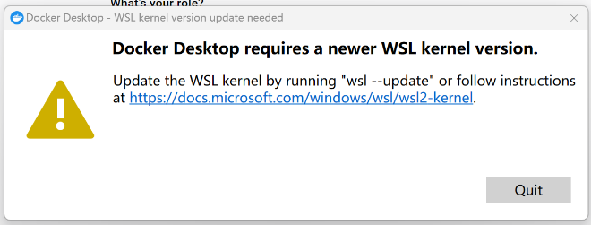

## 问题一

> cmd/powershell 运行 `wsl --update` 即可，然后重启

## 问题二
  - 如果提示如下：
    - Please try shutting WSL down (wsl --shutdown) and/or rebooting your computer. If not sufficient, WSL may need to be reinstalled fully. As a last resort, try to uninstall/reinstall Docker Desktop. If the issue persists please collect diagnostics and submit an issue (https://docs.docker.com/desktop/troubleshoot/overview/#diagnose-from-the-terminal).
    - cmd/powershell 运行 `netsh winsock reset` 即可，然后重启
