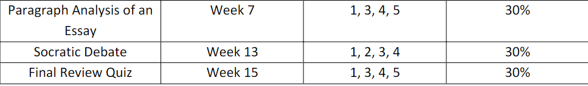

> 出发之前准备：
> 1. 找一个人替**7,8,9周 周二五六**的数字信号处理实验课
> 2. 找一个人替**每周 周三**的工程经济学小班课
> 3. 找一个人替**每周 周四早八**的英语课
> 4. 考试坐车回来

- 体测
  - 体测时间：10.15（周日） 早八点
  - 体测坐车回来，无需请假

- 英语课找人替课
  - 考试时间：
  - 考试坐车回来，请假

- 工程经济学
  - 大班上课学习通签到（周二）
  - 小班上课找人替课（周三）

- 通信原理
  - 每周两节，周一和周四
  - 如果不是学习通签到，找人替课

- 数字信号处理
  - 目前不点名
  - 如果不是学习通签到，找人替课
  - 如果有课上quiz，坐车回来，请假
  - 实验课：5，7，8，9周 周二，找人替课

- 电路分析与设计
  - 如果不是学习通签到，找人替课
  - quiz时候远程答题，看命了
  - 期中考试请假，坐车回来，时间未定

- 复习计划
  - 下班之后
